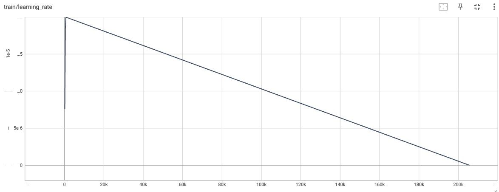
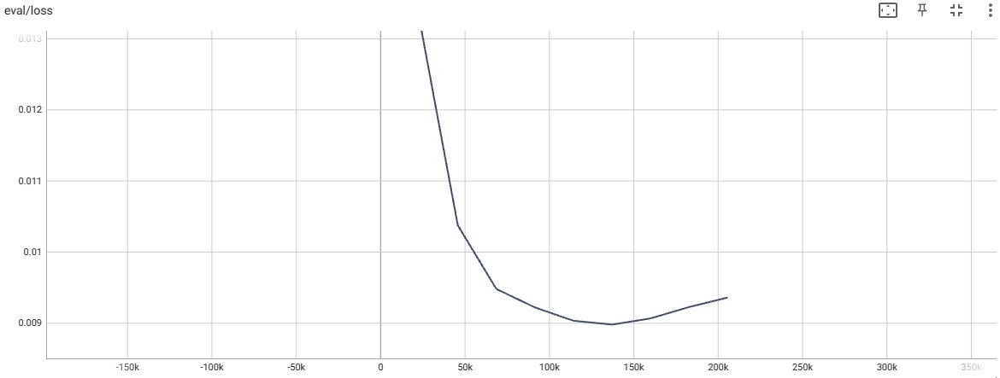
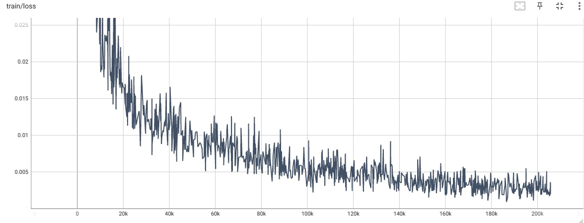

# NYCU_Machine Learning 2023-Translate
### 312605015詹恆瑜
## Author
|Student ID|GitHub Account|Name|Email| 
| :--:    | :--:   |:--:  | :--: |
|312605015|312605015|詹恆瑜|happydog101155@gmail.com| 

---
>環境檔: environment.yml
>>channels:
>>1. pytorch
>>2. huggingface
>>3. nvidia
>>4. defaults
##
>執行程式碼: transformer.py
##
>輸出檔案
>>1. 訓練結果log檔位置: logs_all_folds2  
>>2. 訓練過程checkpoint檔位置: results_all_folds2

##
>其他資料(訓練照片、介紹)
>>1. learnrate.jpg  
>>2. val_loss.jpg  
>>3. train_loss.jpg  
>>4. README.md
##

1.作法說明
===
主要調整參數及比較:
|  |  |  |   |    |   *資料增強  |
| :--:    | :--:   |:--:   |   :--:   | :--:   | :--:  |
| Epochs  |   3     |   7   |   9     |    9  |   9 |
| bachsize |   8    | 8   |    4    |    4    |   4  |
| weight_delay|  0.01 | 0.03|   0.03  |   0.045  | 0.05  |
|kaggle score|  11.58 | 10.22 |  8.84    |   8.85  |   6.34   |
  
這次的機器翻譯模型我採用transformer，上網查詢了很多資料以及參考了稍上課提及的網站，我最後使用網路上的transformer來實測，首先我先定義好訓練用資料及以及測試用資料集後，再對我的資料作預處理，先把資料讀進來後，再把訓練資料的id和""等不重要的資料給刪掉再拿來訓練。  
因為比較少資料在做中文轉台文的翻譯，所以我直接使用中文轉英文的分詞器和訓練模型來做訓練，此種分詞器是子詞對子詞的分詞器，此種方法可以找到最常見的字符，若找不到相關字符就會將其拆解變成他的常用字符，接下來就是使用k-flod的方式切割驗證集並進行訓練，訓練參數主要是我這次調整的部分，上方表格有我主要測試的數據結果，特別的是我這次使用tensorboard來繪製出訓練曲線圖，在訓練與驗證做完之後，在讀取我們的測試資料集，讀取txt""裡面的文字後，對裡面的文字做分詞等資料預處理，最後再將我們訓練的模型拿來測試，並將預測結果依我的要求格式輸出成csv檔。

推理:  
重建環境"$conda env create -f environment.yml"  

$ python transformer.py 

2.程式方塊圖與寫法
===============

首先import必要的函式來執行之後的程式
``` python
import pandas as pd
import torch
from torch.utils.data import Dataset, DataLoader
from sklearn.model_selection import KFold
from transformers import MarianTokenizer, MarianMTModel, Trainer, TrainingArguments
import random
```
接著定義資料增強的函數、訓練資料集類別、測試資料集類別，之後我們會將我們的資料讀取後，經過此定義類別來使用所需要的功能。
``` python
# 數據增強函數
def augment_text_char_level(text, p=0.1):
    chars = list(text)
    augmented_chars = []
    for char in chars:
        if random.random() < p:
            operation = random.choice(["delete", "insert", "replace"])
            if operation == "delete":
                continue
            elif operation == "insert":
                augmented_chars.append(random.choice(chars))
            elif operation == "replace":
                augmented_chars.append(random.choice(chars))
        augmented_chars.append(char)
    return "".join(augmented_chars)
# 定義資料集類別
class TranslationDataset(Dataset):
    def __init__(self, tokenizer, texts_zh, texts_tl, max_length=512):
        self.tokenizer = tokenizer
        self.texts_zh = texts_zh
        self.texts_tl = texts_tl
        self.max_length = max_length

    def __len__(self):
        return len(self.texts_zh)

    def __getitem__(self, idx):
        source_text = self.texts_zh[idx]
        target_text = self.texts_tl[idx]

        source_encoded = self.tokenizer(
            source_text, max_length=self.max_length, padding='max_length', truncation=True, return_tensors="pt"
        )
        target_encoded = self.tokenizer(
            target_text, max_length=self.max_length, padding='max_length', truncation=True, return_tensors="pt"
        )

        return {
            'input_ids': source_encoded['input_ids'].squeeze(),
            'attention_mask': source_encoded['attention_mask'].squeeze(),
            'labels': target_encoded['input_ids'].squeeze()
        }

# 測試資料集類別
class TestDataset(Dataset):
    def __init__(self, tokenizer, texts_zh, max_length=512):
        self.tokenizer = tokenizer
        self.texts_zh = texts_zh
        self.max_length = max_length

    def __len__(self):
        return len(self.texts_zh)

    def __getitem__(self, idx):
        source_text = self.texts_zh[idx]

        source_encoded = self.tokenizer(
            source_text, max_length=self.max_length, padding='max_length', truncation=True, return_tensors="pt"
        )

        return {
            'input_ids': source_encoded['input_ids'].squeeze(),
            'attention_mask': source_encoded['attention_mask'].squeeze()
        }
```

接著我們設定cuda讓我們等等訓練時可以使用gpu來跑，讀取訓練資料之後再將資料中有用的txt""中的文字提取出來訓練，所使用的分詞器選用中文轉英文的Helsinki-NLP/opus-mt-zh-en分詞器來做訓練，因為老師說可以多試看看，於是我多用了較大和較小型的模型有嘗試過，較小的模型效果確實比較差，而較大的模型他的時間需要預計時間要好幾天，最後我就選擇了這個模型，且在對我八成的訓練資料進行數據增強，並再設定k-flod的k值參數再開始訓練。
``` python
# 設置 CUDA
device = torch.device("cuda" if torch.cuda.is_available() else "cpu")
print(f"Using device: {device}")

# 讀取和準備資料
data_folder = "C:\\software\\python\\ml_translate\\translation"
train_zh = pd.read_csv(f"{data_folder}/train-ZH.csv")
train_tl = pd.read_csv(f"{data_folder}/train-TL.csv")

train_zh_txt = train_zh['txt'].str.strip('"')
train_tl_txt = train_tl['txt'].str.strip('"')

# 初始化分詞器
model_name = "Helsinki-NLP/opus-mt-zh-en"
tokenizer = MarianTokenizer.from_pretrained(model_name)

# 隨機選擇八成的訓練數據進行增強
indices_to_augment = random.sample(range(len(train_zh_txt)), int(len(train_zh_txt) * 0.8))

augmented_train_zh = []
augmented_train_tl = []
for idx, (zh, tl) in enumerate(zip(train_zh_txt, train_tl_txt)):
    augmented_train_zh.append(zh)
    augmented_train_tl.append(tl)

    if idx in indices_to_augment:
        augmented_zh = augment_text_char_level(zh)
        augmented_train_zh.append(augmented_zh)
        augmented_train_tl.append(tl)

# 交叉驗證設置
n_splits = 5
kf = KFold(n_splits=n_splits)

```
訓練開始後，同樣是將訓練資料經過剛剛寫的TranslationDataset後，丟進我設好的參數中進行訓練，我本來batch_size是8，我把他調到4來增加可能震盪的機會，且提高了epoch和weight_delay的值，這樣的調整是因為epoch的升高可能會讓模型過擬合，藉著利用weight_delay的提升模型泛化的能力，讓我的模型可以訓練得更加理想，並將訓練過程的log存下來，之後用tensorboard來看訓練的效果怎麼樣，這邊我會取交叉驗證的最後一次來看訓練成果圖，以及訓練的模型checkpoint等都會存在results_all_folds2中。 
``` python
for fold, (train_idx, val_idx) in enumerate(kf.split(augmented_train_zh)):
    print(f"Training fold {fold + 1}/{n_splits}")

    train_texts_zh = [augmented_train_zh[i] for i in train_idx]
    train_texts_tl = [augmented_train_tl[i] for i in train_idx]
    val_texts_zh = [augmented_train_zh[i] for i in val_idx]
    val_texts_tl = [augmented_train_tl[i] for i in val_idx]

    train_dataset = TranslationDataset(tokenizer, train_texts_zh, train_texts_tl)
    val_dataset = TranslationDataset(tokenizer, val_texts_zh, val_texts_tl)

    training_args = TrainingArguments(
        output_dir='./results_all_folds2',
        per_device_train_batch_size=4,
        per_device_eval_batch_size=4,
        num_train_epochs=9,
        evaluation_strategy="epoch",
        save_strategy="epoch",
        learning_rate=2e-5,
        warmup_steps=500,
        weight_decay=0.05,
        logging_dir='./logs_all_folds2',
        logging_steps=10,
    )

    model = MarianMTModel.from_pretrained(model_name).to(device)
    trainer = Trainer(
        model=model,
        args=training_args,
        train_dataset=train_dataset,
        eval_dataset=val_dataset
    )

    trainer.train()
```
訓練結束之後，首先載入測試資料集，並提取出訓練測試的文字內容，經過我們前面定義好的TestDataset之後就用我們訓練好的模型拿來測試它，接著就訓練結果依照我們要的格式給輸出出來，並將它存成csv檔。
```python
# 載入測試資料集
test_zh = pd.read_csv(f"{data_folder}/test-ZH-nospace.csv")
test_texts_zh = test_zh['txt'].str.strip('"').tolist()

# 創建測試資料集
test_dataset = TestDataset(tokenizer, test_texts_zh)
test_dataloader = DataLoader(test_dataset, batch_size=32)

# 預測
model.eval()
predictions = []
for batch in test_dataloader:
    input_ids = batch['input_ids'].to(device)
    attention_mask = batch['attention_mask'].to(device)
    with torch.no_grad():
        outputs = model.generate(input_ids=input_ids, attention_mask=attention_mask)
    predictions.extend([tokenizer.decode(t, skip_special_tokens=True) for t in outputs])

# 創建預測結果 DataFrame
predictions_df = pd.DataFrame({
    "id": test_zh['id'],
    "txt": predictions
})

# 將預測結果保存為 CSV 檔案
predictions_df.to_csv(f"{data_folder}/prediction.csv", index=False)
```

3.畫圖做結果分析
===

由上圖可以看到我訓練過程中的學習率很快的上升到一個上限值後，會再以一個比例不斷的一值衰減，這跟我設計的warmup_steps值有關，可以調整它多快達到學習率峰值，我想這個設計是希望前面訓練時還離收斂很遠時可以先用較大的學系率來跑，到快收斂時就不斷地減少學習率來慢慢收斂，讓收斂效果更好能把loss給降到更低。


由上圖的val_loss可以看到前期有顯著的下降，一直到後期要收斂的時候，可以發現val_loss有點逐漸上升的趨勢，可以知道可能是已經要過擬合了，所以以這參數來說這邊的訓練可能已經達到它的收斂極限了。


從上圖的訓練loss可以看到它的震盪是蠻大的，主要是因為我的batch_size給它從8降低到4的關係，讓他增加震盪機會使得泛化的機會可以高一點，可以發現我訓練的loss都有穩定在慢慢往下，但由第二張圖可以看到val_loss已經到了極限，所以我就更加確定到達過擬合了。


4.討論預測值誤差很大的，是怎麼回事?
===
我訓練過程中遇到的訓練效果不是很完美的時候，我發現我的問題是我的訓練次數不夠，所以我調高了我的epochs數值，之後我再印出我的訓練結果之後，我發現我的訓練有點達到過擬合了，正如我上面圖片推論所說，所以我試著想要如何增加它的泛化能力，所以誤差很大、成果不夠好的情況，我大都是因為訓練次數不夠多以及訓練過程達到過擬合了。

5.如何改進
===
經過這次實驗我不斷的嘗試如何在有限的資料中把訓練的效果給提高，我推測的方法有使用較大的預訓練模型、提高資料增強的效果、以及分詞器的挑選，關於這些方法的挑選和實驗就花了我不少的時間，挑選較大的模型又會花上許多時間，這可能在電腦硬體提升過後可以多加嘗試，以及資料增強方面還要挑選對本次任務適合的方法，且會同樣花上原先時間的兩倍以上時間，我也因為時間關係，所以我做的資料增強只對部分資料去做，我想這方面可以再讓模型得到更多的改善，而分詞器方面我想可以嘗試看看其他種方式，有時間的話我想我未來可以往這些方向去改善我的機器翻譯效果。

6.心得
===
這次的機器翻譯作業花了我非常多的時間，因為之前從沒有親自實作過相關的事物，所以查詢了許多相關原理和知識，之後我也花了不少時間在想資料預處理，以及調整參數來嘗試會不會做得更好，我最後的測試是對訓練資料做資料增強，藉由在我的訓練資料用刪除、插入、替換的方式去做變化，以增加我訓練效果，達到泛化效果增強，也從我在kaggle的分數可以看到，確實有在訓練上有些提升，因為這次的作業讓我對transformer的結構以及seqtoseq的機器學習原理更加熟悉，這也讓我更加深入了AI的世界，我每次做完作業我都會想如何把它應用的更廣，可以帶給生活能有更多的便利，我想這一次的作業帶給我的收穫可以成為我很棒的養分。